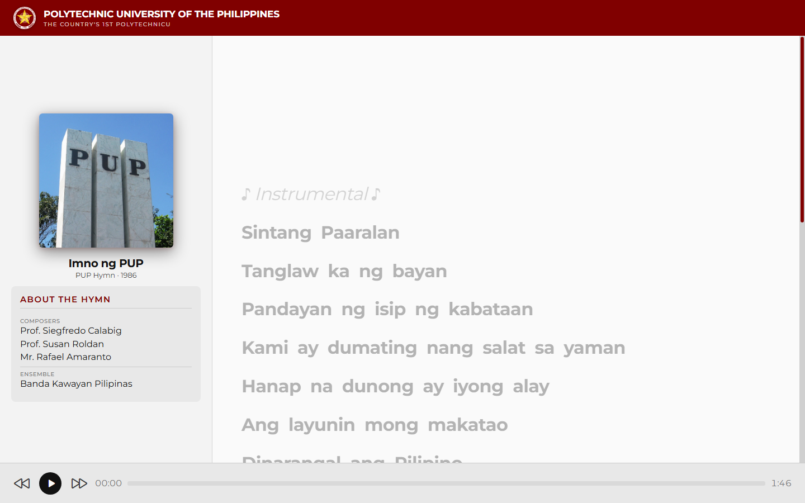

# PUP Hymn Karaoke

<p align="center">
  <strong>Browser karaoke for the PUP school hymn with word-level LRC sync.</strong><br>
  Vanilla HTML, CSS, and JavaScript. No build step.
</p>

<p align="center">
  <a href="https://cikeyz.github.io/pup-hymn-karaoke/">Live Demo</a>
  &nbsp;·&nbsp;
  <a href="#quick-start">Quick Start</a>
  &nbsp;·&nbsp;
  <a href="#project-structure">Structure</a>
  &nbsp;·&nbsp;
  <a href="#license">License</a>
</p>

<p align="center">
  
  
  
  
  
</p>

## Contents

- [Overview](#overview)
- [Features](#features)
- [Screenshots](#screenshots)
- [Quick Start](#quick-start)
- [Project Structure](#project-structure)
- [Design Notes](#design-notes)
- [Other Design Eras](#other-design-eras)
- [License](#license)
- [Course Note](#course-note)

## Overview

PUP Hymn Karaoke is a single-page player for *Imno ng PUP*. It parses word-level LRC timestamps, highlights the active word, auto-scrolls the lyric panel, and supports click-to-seek plus transport controls. Open `index.html` locally or use the GitHub Pages demo.

## Features

| Feature | Description |
|---------|-------------|
| Word-level sync | Highlights each word from LRC timestamps as audio plays |
| Click-to-seek | Jump to any word by clicking it |
| Auto-scroll | Keeps the active line in view during playback |
| Transport | Play/pause, skip, and a seekable progress bar |
| Offline friendly | Static files only; no bundler or backend |

## Screenshots

| Player |
|--------|
|  |

## Quick Start

```bash
git clone https://github.com/cikeyz/pup-hymn-karaoke.git
cd pup-hymn-karaoke

# Option A: open index.html in a browser

# Option B: local static server
python -m http.server 8000
# http://localhost:8000
```

## Project Structure

```text
pup-hymn-karaoke/
├── index.html
├── script.js
├── style.css
├── LICENSE
├── README.md
├── assets/
│   ├── PUP-Hymn.lrc
│   ├── PUP-Hymn.mp3
│   ├── PUP-Logo.svg
│   └── PUP-Pylon.jpg
└── docs/
    └── screenshots/
        └── player.png
```

## Design Notes

- Maroon primary aligned with PUP brand colors (`#800000`)
- Montserrat for UI type
- Split layout: track/sidebar info + scrolling lyrics

## Other Design Eras

Earlier UI experiments stay on long-lived branches (not merged into `main`):

| Branch | Description |
|--------|-------------|
| `overhaul/dark-spotify-shell` | Dark app shell with now-playing sidebar |
| `overhaul/centered-dark-player` | Centered dark player with marquee bar |

## License

MIT. See [LICENSE](LICENSE).

The PUP Hymn audio, university name, and logos belong to the Polytechnic University of the Philippines. Source code is MIT; media and marks are not free for commercial reuse.

## Course Note

Built for CMPE 364 (Web and Mobile Systems), Polytechnic University of the Philippines, under Engr. Arlene B. Canlas. Published here as a standalone project.
